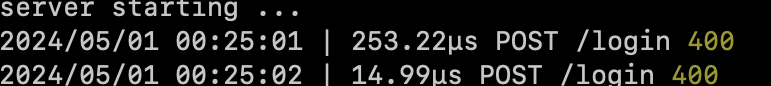

# prettylogger
[](https://github.com/idugan100/env/actions/workflows/main.yml)

pretty logger is a minimal, lightweight server logging package. Below is some example output:



This package can be installed with ```go get github.com/idugan100/prettylogger```

You can use the ```go doc``` command to see the documentation for this package. You can learn more about this [here](https://pkg.go.dev/cmd/doc).
